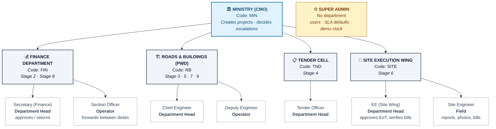
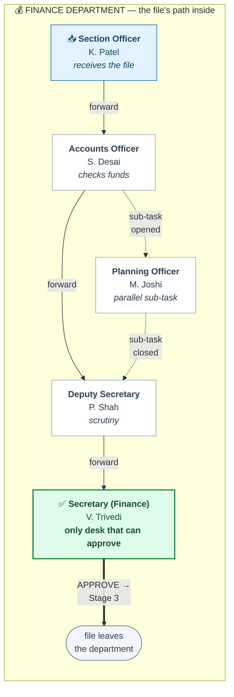
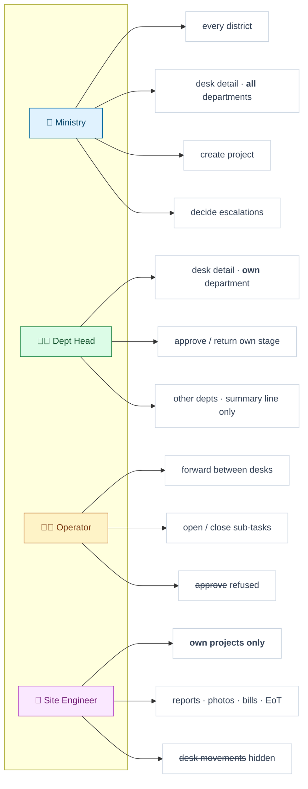
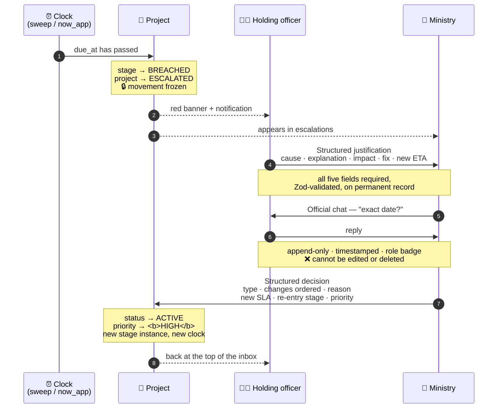
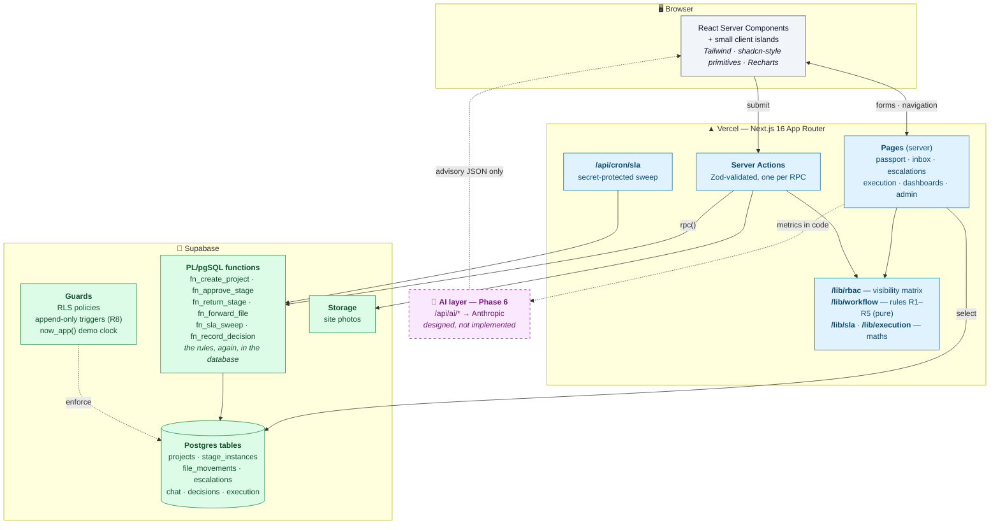
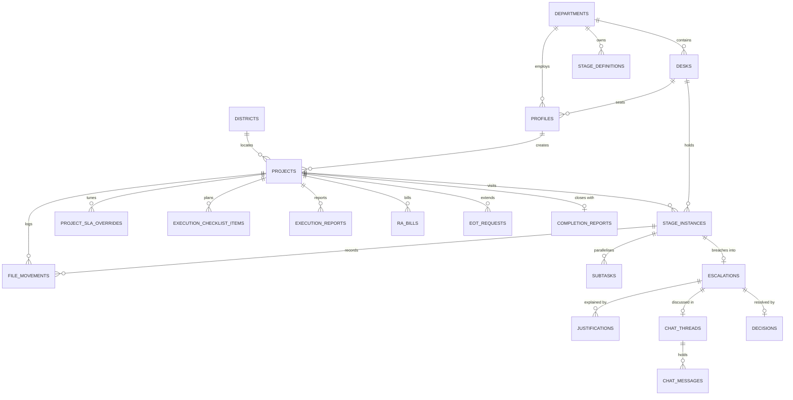
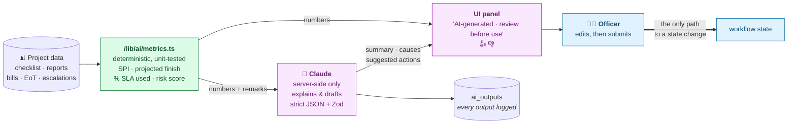

# PWFTS — Public Works File Tracking & Project Monitoring System

**Where is the file? With whom? For how long? And why?**

A government construction project passes through five departments and nine statutory
stages before a road is opened or a hospital admits its first patient. Most of the delay
does not happen at the site. It happens while a **file sits on a desk** and nobody can
say whose desk, or for how long.

This system answers those four questions for any Project ID, in one screen, for every
officer from the Chief Minister's Office down to the Junior Engineer holding the
measurement book.

> **Status.** Phases 0–5 of `DEVELOPMENT_PLAN.md` are built and tested. The AI layer
> (Phase 6) is **designed but not implemented** — it is documented in full at the end,
> clearly marked, because the architecture was shaped to receive it.

---

## Table of contents

1. [The problem, from inside the office](#1-the-problem-from-inside-the-office)
2. [Who uses it — the department hierarchy](#2-who-uses-it--the-department-hierarchy)
3. [How a file moves — the nine stages](#3-how-a-file-moves--the-nine-stages)
4. [Inside one department — the desk hierarchy](#4-inside-one-department--the-desk-hierarchy)
5. [First-person: what each officer sees](#5-first-person-what-each-officer-sees)
6. [The eight rules, and why each exists](#6-the-eight-rules-and-why-each-exists)
7. [When an SLA breaks — the escalation loop](#7-when-an-sla-breaks--the-escalation-loop)
8. [Features built, and why we chose them](#8-features-built-and-why-we-chose-them)
9. [System architecture](#9-system-architecture)
10. [Data model](#10-data-model)
11. [Trust: audit, permissions and the demo clock](#11-trust-audit-permissions-and-the-demo-clock)
12. [The AI layer — designed, not yet built](#12-the-ai-layer--designed-not-yet-built)
13. [Demo credentials](#13-demo-credentials)
14. [Demo script](#14-demo-script)
15. [How it was verified](#15-how-it-was-verified)
16. [Out of scope, and assumptions to validate](#16-out-of-scope-and-assumptions-to-validate)

---

## 1. The problem, from inside the office

Picture the Executive Engineer of an R&B division in Vadodara. A bridge project was
sanctioned eleven months ago. The MLA wants to know when it will open. The EE knows the
site is not the hold-up — the file went to Finance in March and something happened there.
Or possibly it came back and is sitting with his own Superintending Engineer. He cannot
tell, because:

- The movement register is a **paper ledger** in a different building.
- Each department keeps its **own** register, and nobody can read anyone else's.
- There is no clock. A file that has been on a desk for 40 days looks exactly like one
  that arrived this morning.
- When a delay is finally noticed, the explanation is a phone call. Nothing is on record,
  so the same cause recurs next quarter with nobody accountable.

**What PWFTS changes**

| Before | After |
|---|---|
| "The file is somewhere in Finance." | `With Finance Department · 12 days · SLA 21 days` |
| Paper register, one department only | Append-only digital trail, desk by desk |
| No deadline per stage | An SLA clock on every stage, amber at 75%, red past due |
| Delay explained by phone | A structured justification on permanent record |
| Ministry finds out at review time | Ministry is notified the moment the clock breaks |
| Late file re-enters silently | Re-enters with **HIGH priority** and a Ministry-set SLA |

---

## 2. Who uses it — the department hierarchy

Five departments, nine officers in the demo, each with a defined slice of visibility.



**Why five departments and not a flat user list.** The whole product is about *handover
between organisations*. A flat list of users would make "the file is with Finance"
impossible to express. The department is the unit of both ownership and secrecy: it owns
stages, and it is the boundary beyond which desk-level detail is not shown.

---

## 3. How a file moves — the nine stages

Exactly one stage is active at a time (**rule R1**). Each has an owning department and a
default SLA in days.

```mermaid
flowchart LR
    S1["<b>1 · Ministry Proposal</b><br/>MIN · 15d<br/><i>Project ID generated</i>"]
    S2["<b>2 · Administrative<br/>Approval</b><br/>FIN · 21d"]
    S3["<b>3 · Technical<br/>Sanction</b><br/>RB · 21d"]
    S4["<b>4 · Tender</b><br/>TND · 45d"]
    S5["<b>5 · Work Order</b><br/>RB · 7d"]
    S6["<b>6 · Site Execution</b><br/>SITE · 180d"]
    S7["<b>7 · Completion<br/>Report</b><br/>RB · 15d"]
    S8["<b>8 · Final Bill</b><br/>FIN · 30d"]
    S9["<b>9 · DLP &amp; Closure</b><br/>RB · 365d"]

    S1 --> S2 --> S3 --> S4 --> S5 --> S6 --> S7 --> S8 --> S9
    S9 --> DONE(["✅ Project closed"])

    S3 -.->|"<b>RETURN</b><br/>reason mandatory<br/>SLA restarts"| S2
    S4 -.->|"RETURN"| S3

    classDef stage fill:#f8fafc,stroke:#0369a1,stroke-width:2px,color:#0f172a
    classDef done fill:#dcfce7,stroke:#15803d,color:#14532d
    class S1,S2,S3,S4,S5,S6,S7,S8,S9 stage
    class DONE done
```



Two kinds of movement exist, and the difference matters:

| | **Forward** (desk to desk) | **Advance** (stage to stage) |
|---|---|---|
| Who | Head *or* operator | **Only the head** of the owning department |
| Scope | Inside one department | Hands the file to the next department |
| Clock | Same SLA keeps running | New stage instance, new SLA |
| Rule | — | R3 |

A **return** goes to *any* earlier stage, needs a written reason, and opens a fresh stage
instance so the SLA restarts (**R4**). Returns are why the passport shows "2 attempts" on
a stage — the loop is visible rather than hidden.

---

## 4. Inside one department — the desk hierarchy

A department is not one inbox. A file lands at a junior desk, climbs to the head for
approval, and may be sent sideways for a parallel opinion.



**Parallel work without parallel stages (R2).** Accounts and Planning can hold sub-tasks
at the same time — real offices do this constantly. But the *stage* stays single. The head
cannot approve while any sub-task is open, so concurrency is modelled honestly without
breaking "one active stage".

The R&B division has a deeper ladder, which is where bottlenecks usually hide:

```
Junior Engineer → Deputy Engineer → Executive Engineer → Superintending Engineer → Chief Engineer ✅
```

Sixteen desks are seeded across the five departments, with realistic designations drawn
from the CPWD structure.

---

## 5. First-person: what each officer sees

The same Project ID shows five different screens. This is the heart of the design.

### 👔 "I am the Ministry (CMO)"

I open the dashboard and see **every district**: how many projects are active, how many
are at risk, how many have breached, and how much money is committed. I see the
HIGH-priority list — the files I personally sent back into the flow after an escalation.

I am the only role that can **create a project**, and the Project ID is generated at that
moment and never again. I am also the only role that can **decide an escalation**.

Crucially, I can see **desk-level detail in every department**. Nobody else can. When the
Finance Secretary tells me the file was with Accounts for three weeks, I can already see it.

### 🧑‍💼 "I am a Department Head" (Finance Secretary, Chief Engineer, …)

My dashboard is about **my department's health**: how many files I hold, split
green / amber / red, and a per-desk table showing who is holding what and how long they
usually take. The slowest desk is highlighted — that is my bottleneck, and it is the
number I would otherwise never have.

I am the only person who can **approve** a stage my department owns, or **return** it to
an earlier stage with a written reason. I cannot approve another department's stage —
the button is not merely hidden, the database refuses it.

For other departments I see a **summary line only**: `With Finance Department · 12 days ·
SLA 21 days`. Enough to chase; not enough to read their internal workings.

### 🧑‍💻 "I am a Department Operator"

I do the actual moving. My inbox lists the files in my department, **HIGH priority first,
then least SLA remaining** — so the order I work in is decided by the system, not by
whichever email shouted loudest. I forward files between desks, open and close sub-tasks,
and write remarks that become part of the permanent record.

I cannot approve. I cannot forward outside my department. Both are refused server-side.

### 👷 "I am a Site Engineer"

I only see **my** projects — not the district, not other departments' files. For each, I
see planned versus actual progress, and how many weekly reports I have missed.

I submit reports with progress %, remarks, issues and **site photos**. Submitting updates
the checklist and moves the progress bar on the passport that the Ministry is looking at.
I raise **RA bills** and request an **extension of time** when the monsoon stops work.

### ⚙️ "I am the Super Admin"

I manage users, desks and SLA defaults. I hold the **demo clock** — +1 day, +7 days,
reset — which is how a live audience watches an SLA breach happen in ten seconds instead
of waiting three weeks. I can also reset the whole demo dataset.

### Visibility at a glance



---

## 6. The eight rules, and why each exists

These are the source of truth. They live **twice** — as pure TypeScript for the UI and the
tests, and as PL/pgSQL inside Postgres — so the interface and the database cannot disagree.

| Rule | What it says | Why it is there |
|---|---|---|
| **R1** | One active stage at a time | Without it "where is the file" has several answers, which is the problem we set out to kill |
| **R2** | Sub-tasks may run in parallel *inside* a stage; the stage cannot advance until all close | Real offices parallelise. Modelling it as parallel *stages* would break R1; modelling it as sub-tasks keeps both truths |
| **R3** | Only the head of the owning department approves | Accountability needs a name. If anyone could advance a file, nobody is answerable for it |
| **R4** | A return may go to any earlier stage; reason mandatory; SLA restarts | Returns are the most common hidden delay. Forcing a written reason turns an invisible loop into evidence |
| **R5** | The Project ID is generated only at Stage 1 | One identity from proposal to closure, `GJ-RB-2026-AHD-0042`, so every department names the same thing the same way |
| **R6** | Every stage instance carries an SLA, overridable per project | A 5-crore school and a 240-crore flyover cannot share one deadline |
| **R7** | Breach → freeze → justification → chat → decision → re-entry at HIGH priority | The core loop. A breach must *cost* something procedurally, or the clock is decoration |
| **R8** | Movements, chat and decisions are append-only | An audit trail that can be edited is not an audit trail. Enforced by database triggers, not by convention |

---

## 7. When an SLA breaks — the escalation loop

This is rule R7, and it is the feature that turns a tracker into an accountability system.



**The colour rule.** Green until 75% of the SLA is used, amber from 75%, red once
breached. Amber is the point of the whole thing: it is a warning you can still act on.

**Why the file cannot move while escalated.** If work continued during the review, the
justification would be theatre. Freezing forward movement is what makes the Ministry's
decision consequential.

**Why re-entry is HIGH priority.** A delayed project that rejoins the queue in normal
order will be delayed again. HIGH priority sorts it to the top of the receiving
department's inbox automatically.

---

## 8. Features built, and why we chose them

### Phase 0–1 · Foundation
| Feature | Why |
|---|---|
| 5 departments, 16 desks, 3 districts, 9 officers | Desk-level tracking is the differentiator; it needs real desks |
| 15 seeded projects across all 9 stages | A demo with three tidy projects proves nothing. The seed deliberately includes 3 on track, 3 at ≥75% SLA, 2 breached, 2 with return loops, 1 HIGH-priority re-entry, 2 in execution, 1 completed |
| Role-aware navigation | An officer should not see doors they cannot open |

### Phase 2 · The core ⭐
| Feature | Why |
|---|---|
| **Project Passport** — 9-stage stepper, days vs SLA, return loops, re-entry markers | The one screen that answers all four questions at once |
| **Movement log** with other departments collapsed to a summary line | Exactly the visibility rule from the manual; this is what makes it deployable across real departments |
| **Department inbox**, HIGH priority then least SLA remaining | Turns a pile into a work order |
| **Create Proposal** with per-stage SLA overrides | Rule R6, at the only moment the Ministry has the context to set them |
| Permissions enforced in the UI **and** the database | A hidden button is a UI preference. A refused RPC is a rule |

### Phase 3 · Accountability ⭐
| Feature | Why |
|---|---|
| SLA sweep (`pg_cron`, API route, and on page load) | A breach must be noticed without anyone opening a page |
| **Demo clock** (+1 day / +7 days / reset) | An SLA product is unwatchable in real time. Every timestamp reads through `now_app()` so the whole system moves together |
| Structured justification | Free text cannot be analysed. Five fixed fields can be counted, compared, and later fed to the AI layer |
| **Official chat**, append-only, role-badged | Replaces the phone call that leaves no trace |
| **Structured decision** → re-entry | Converts a conversation into a state change with a new clock |

### Phase 4 · Execution to closure
| Feature | Why |
|---|---|
| Checklist auto-created on Work Order approval | Planned vs actual only works if "planned" exists before work starts |
| Reports with progress %, issues and **photos** | Evidence, not assertion |
| **Report compliance** ("2 missed") | A missing report is itself an early warning |
| RA bills: submitted → verified → paid | Money is a delay cause; without it the delay picture is incomplete |
| **EoT** — approval extends the live due date | Legitimate delay should adjust the clock, on record, rather than be argued about later |
| **Completion report with computed delays** | Delay days and reasons are derived from the project's own history — overruns, escalations, extensions. Nobody writes the delay narrative by hand, so nobody can soften it |
| Final bill dues, DLP countdown, close | The last mile that most trackers skip |

### Phase 5 · Making it usable
| Feature | Why |
|---|---|
| Role dashboards incl. **bottleneck desk** | The single most actionable number for a department head |
| Notification bell, derived from live state | No notification table to drift out of sync with reality |
| Mobile navigation | Site engineers file reports from the site |
| Loading, empty, error states | Judges click the paths you did not rehearse |
| Accessibility audit (axe-core) | Government software has an accessibility obligation, and a named violation is fixable where a score is not |

---

## 9. System architecture



### The one idea worth taking away

**The rules live in one place, twice.**

```
src/lib/workflow/index.ts   ── pure TypeScript ──  used by the UI to disable buttons
        │                                          and by 55 unit tests
        │  same rules
        ▼
supabase/migrations/0003    ── PL/pgSQL ─────────  enforced on every write, whatever
                                                   the caller
```

The TypeScript copy exists so the interface can be honest *before* you click — the Approve
button is absent when you may not approve. The SQL copy exists so the rule holds even if
someone bypasses the interface entirely. Neither is decoration: the browser tests assert
the button is hidden, and 17 database checks assert the function refuses.

### Technology choices

| Layer | Choice | Why this one |
|---|---|---|
| Framework | **Next.js 16 (App Router) + TypeScript** | One codebase for screens and server logic; server actions keep workflow writes off the client entirely |
| UI | **Tailwind + hand-written shadcn-style primitives** | Government-dashboard plainness, no CLI step in the build, full control of contrast |
| Database | **Supabase (Postgres)** | Real SQL for a workflow engine; RLS and `SECURITY DEFINER` functions are the right shape for departmental secrecy |
| Validation | **Zod** | One schema for the form and the server action |
| Charts | **Recharts** | Composable, sensible defaults |
| Tests | **Vitest + Playwright + axe-core** | Rules deserve unit tests; a demo deserves a browser test that proves it |

---

## 10. Data model



**The table that carries the idea: `stage_instances`.** A project does not have nine rows,
one per stage. It has a row for **every visit** to a stage. Return to Administrative
Approval and a second `ADMIN_APPROVAL` row appears with `attempt_no = 2`,
`entered_via = RETURN`, and a fresh `due_at`. That single decision is what makes loops,
re-entries and honest per-stage timing possible — and it is why the passport can show
"2 attempts" instead of quietly overwriting the first one.

**`file_movements` is the ledger.** Every receipt, forward, sub-task, approval, return,
escalation and re-entry is one append-only row. It is the digital replacement for the
paper movement register, and nothing deletes from it.

---

## 11. Trust: audit, permissions and the demo clock

Three mechanisms, each answering a different "but could someone…?"

### Append-only, enforced by the database

```sql
create trigger chat_messages_append_only
  before update or delete on chat_messages
  for each row execute function fn_block_mutation();
```

Withholding UPDATE permission is not enough, because the server connects with a key that
bypasses row-level security. A **trigger fires for every role**. Chat messages, decisions,
justifications and file movements cannot be rewritten by the application, by a bug, or by
anyone holding the service key.

Rebuilding the demo data is still possible — `fn_reset_data` uses `TRUNCATE`, which does
not fire row-level delete triggers. That is the distinction worth keeping: **you may
rebuild the whole demo; you may not quietly edit one line of history.**

### Permissions, twice over

The UI removes what you cannot do; the database refuses it anyway. Verified both ways:
the browser test asserts an R&B head has no Approve button on a Finance stage, and a
database check asserts `fn_approve_stage` raises for the same user.

### `now_app()` — the demo clock

Every timestamp in the system reads through one function:

```sql
create function now_app() returns timestamptz as $$
  select now() + (select offset_minutes from system_clock) * interval '1 minute';
$$;
```

Nothing calls `now()` directly. So when the Super Admin presses **+7 days**, the entire
system — SLA colours, breach detection, DLP countdowns, report compliance — moves together,
and a breach that would take three weeks happens in front of the audience. Reset returns
everything.

---

## 12. The AI layer — designed, not yet built

> ⚠️ **Not implemented.** This section documents Phase 6 as designed. No AI code ships in
> the current build, and the application runs entirely without it.

### The governing principle

**AI recommends; officers decide.** No AI output changes workflow state. Every suggestion
lands in a form a human then submits.

The second principle matters just as much for a government audience: **the numbers are
computed in code, and the model only explains and drafts.** Schedule variance, breach
probability, delay days — all arithmetic, all testable, all defensible. If a judge asks
"how did you get 23 days?", the answer is a formula, not a prompt.



### The four features

**1 · Delay prediction** (Site Execution) — `POST /api/ai/delay-prediction`

Computed in code: `planned_pct` from the checklist at `now_app()`, `actual_pct` from the
latest reports, `SPI = actual / planned`, `projected_finish = start + elapsed / SPI`, then
risk adjustments for missed reports, open issues, monsoon months (Jun–Sep) and pending
bills. The model receives those numbers plus recent report remarks and returns
`{ summary, top_causes[], recommended_actions[] }`.

> *"Likely 23 days late (HIGH). Main causes: three missed weekly reports, monsoon
> stoppage, aggregate supply. Suggested: pre-position material, add a second roller."*

Much of this already exists — `progressState()` and `reportCompliance()` compute SPI and
missed reports today, and the Execution page shows them.

**2 · SLA breach early warning** (all stages) — `POST /api/ai/breach-risk`

In code: % SLA used, historical average for this stage, days at the current desk, desk
backlog → a logistic-style probability. The model writes one or two sentences and names
who to nudge. Surfaces as an "At risk" badge in the inbox. The desk statistics it needs
are already computed for the bottleneck panel.

**3 · Completion report draft** — `POST /api/ai/completion-draft`

Input: checklist, reports, bills, extensions, escalations, decisions. Output: JSON matching
the completion report fields, pre-filling the form with `ai_drafted = true`. The officer
edits and signs. The deterministic half — delay days and their attribution — **is already
built** and running.

**4 · Escalation assist** — `POST /api/ai/decision-draft`

Input: justification, chat transcript, project history. Output:
`{ chat_summary, key_facts[], suggested_decision_type, suggested_new_sla_days,
suggested_reentry_stage, draft_reason }`, shown beside the Decision form with
"Apply to form". The Ministry still submits.

### Safety properties

| Property | How |
|---|---|
| Never changes state | Endpoints return JSON to a form; only a human submit calls an RPC |
| Key never reaches the browser | All calls server-side under `/api/ai/*` |
| Fails safely | Missing key or API error → "AI unavailable", app unaffected |
| Auditable | Every output written to `ai_outputs` with input hash and model |
| Honest to the user | Labelled "AI-generated · review before use", with thumbs up/down |

### Why the architecture is already shaped for it

The seed carries realistic history, justifications use five fixed fields rather than free
text, the execution maths is pure and tested, and `ai_outputs` exists in the schema today.
Phase 6 is an addition, not a refactor.

---

## 13. Demo credentials

**Password for every account: `Demo@1234`**

After signing in, use the **persona switcher in the top bar** to move between officers
without logging out — the fastest way to show a handover between departments.

### Local / development

| Department | Email | Role | Desk |
|---|---|---|---|
| 🏛️ **Ministry (CMO)** | `ministry@demo` | Ministry | Deputy Secretary (CMO) |
| 💰 **Finance** | `finance.head@demo` | Department Head | Secretary (Finance) |
| 💰 **Finance** | `finance.op@demo` | Department Operator | Section Officer (Finance) |
| 🏗️ **Roads & Buildings** | `rb.head@demo` | Department Head | Chief Engineer |
| 🏗️ **Roads & Buildings** | `rb.op@demo` | Department Operator | Deputy Engineer |
| 📋 **Tender Cell** | `tender.head@demo` | Department Head | Tender Officer |
| 👷 **Site Execution Wing** | `site.head@demo` | Department Head | EE (Site Wing) |
| 👷 **Site Execution Wing** | `site.eng@demo` | Site Engineer | Site Engineer |
| ⚙️ *(none)* | `admin@demo` | Super Admin | — |

### Hosted / Supabase

Supabase Auth rejects `@demo` as a domain, so the hosted copy uses **`@demo.gov.in`** —
`ministry@demo.gov.in`, `finance.head@demo.gov.in`, and so on. Same password, same roles.

### Which login for which screen

| To see | Sign in as |
|---|---|
| District overview, HIGH-priority list | `ministry@demo` |
| **Desk performance + bottleneck desk** | `finance.head@demo` or `rb.head@demo` |
| Forwarding between desks, sub-tasks | `finance.op@demo` |
| Approve / return a stage | the head of the owning department |
| Checklist, SPI, reports, photos, bills, EoT | `site.eng@demo` |
| Completion report, final bill, DLP | `rb.head@demo` / `finance.head@demo` |
| Demo clock, reset data | `admin@demo` |

---

## 14. Demo script

Roughly seven minutes, end to end.

| # | Who | What | What to point at |
|---|---|---|---|
| 1 | Ministry | Create *"Four-lane road, Sanand–Bavla"* | The Project ID appears: `GJ-RB-2026-AHD-00xx` (R5) |
| 2 | Ministry | Approve Stage 1 | The file is now in Finance's inbox |
| 3 | Finance operator | Forward Section Officer → Accounts Officer | The movement log shows the desk hop |
| 4 | **R&B operator** | Open the same movement log | Finance collapses to `With Finance Department · N days · SLA 21 days` — **the visibility rule, live** |
| 5 | Finance head | Close the Planning sub-task, then approve | Approving with a sub-task open is refused (R2) |
| 6 | R&B head | Return to Administrative Approval, reason: *"Estimate uses old SOR rates"* | Passport shows **2 attempts**; the SLA restarted (R4) |
| 7 | Super Admin | Demo clock **+7 days**, twice | The file turns red, an escalation opens, movement freezes |
| 8 | Finance head | Submit the justification | Five structured fields, permanently on record |
| 9 | Ministry | Open the chat, ask a question; switch back and reply | "Logged permanently" — cannot be edited or deleted |
| 10 | Ministry | Record the decision: new SLA 10 days, re-entry at Admin Approval, HIGH | Project re-enters **at the top of Finance's inbox**, badged HIGH |
| 11 | Site engineer | Submit a weekly report with a photo | Progress moves on the checklist and the passport; the missed-report counter updates |
| 12 | Site engineer → Site head | Request an EoT; approve it | The Site Execution due date moves, and the movement log records why |
| 13 | R&B head | Open a Stage 7 project's completion report | **Delay days and reasons are already filled in**, derived from the project's own history |
| 14 | Ministry | Back to the dashboard | District overview, escalations, bottleneck desks |

Closing line: *"Every one of those steps is on an append-only record, and the rules that
allowed or refused each action are enforced by the database, not just by the screen."*

---

## 15. How it was verified

| Suite | Count | What it proves |
|---|---|---|
| **Unit tests** (Vitest) | 55 | Rules R1–R7 as pure functions; SLA colour thresholds; execution maths; a full demo-script walk-through; a project driven Stage 1 → closure |
| **Browser tests** (Playwright) | 9 | The entire demo journey in Chromium with **zero console errors**; phone-width layout with no horizontal scroll; accessibility |
| **Accessibility** (axe-core) | 7 pages | No serious or critical WCAG violations |
| **Database checks** | 17 | The PL/pgSQL functions refuse what they should: wrong department approving, forward returns, empty reasons, cross-department forwards, acting on an escalated project, non-Ministry decisions, and any attempt to edit the audit trail |

Tests that assert a **refusal** matter as much as tests that assert success: a workflow
engine is defined as much by what it will not do.

Three defects were found by the tests rather than by review, each of which would have
surfaced in front of judges:

1. Approve and return confirmations vanished, because the form unmounts when the stage moves on.
2. Real horizontal scrolling on phones — grid items do not shrink below their content.
3. The re-entry dropdown defaulted to Stage 1 instead of the breached stage, which would
   have sent files to the wrong department mid-demo.

And one that only executing the SQL could find: a `CASE` expression returning `text` where
the column is an enum, which would have broken **every** stage opening — create, approve,
return and re-entry alike.

---

## 16. Out of scope, and assumptions to validate

**Deliberately out of scope** (shown as integration points in the architecture, not built):
nProcure, IWDMS / e-Sarkar, PFMS, e-MB, payments, Aadhaar / eSign, offline mobile sync,
GIS maps, multi-state deployment.

**Assumptions a department should validate** before this becomes real:

- The nine-stage sequence and the owning department of each, simplified from the CPWD
  Works Manual Ch. 2 and to be checked against the Gujarat PWD Manual and the
  delegation-of-powers orders.
- The default SLA days per stage.
- That the **Ministry** chooses the re-entry stage in its decision, rather than the file
  automatically resuming where it broke.
- That a project is **frozen** while escalated.

**Known limits of the current build:**

- The hosted deployment needs the Supabase data layer swap; the local JSON store cannot
  persist on a read-only serverless filesystem.
- Report photos are written to `public/uploads/` and need Supabase Storage before hosting.
- The official chat polls every 5 seconds rather than using Supabase Realtime.
- Sign-in uses a demo cookie session with a fixed password, not Supabase Auth. This is
  deliberate for demonstration — it enables the one-click persona switcher — and it is why
  the RLS policies are documentation-plus-defence rather than today's enforcement path.
- The AI layer (Phase 6) is designed and documented, not implemented.

---

### References

- CPWD Works Manual (Ch. 2 — Administrative Approval, Expenditure Sanction, Technical
  Sanction, Availability of Funds)
- CPWA Code (Measurement Book, Running Account Bills)
- CPWD Works Manual 2022 (e-MB on PFMS; no TS for EPC contracts)
- MoSPI PAIMANA portal (national infrastructure project monitoring)
